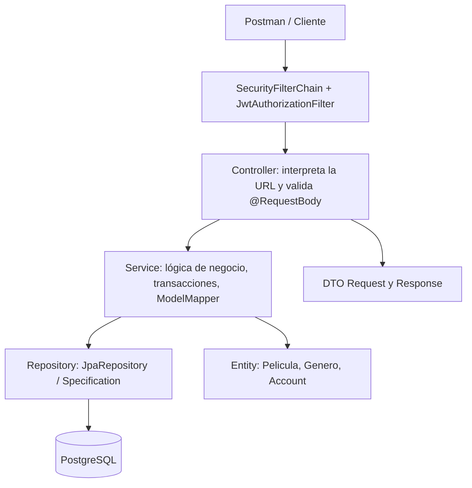

# Guía de estudio: qué poner en cada archivo de CineBox

Este documento es la parte **para estudiar**, mientras el código dentro de `src/` es
la plantilla **para programar**. La estructura sigue los temas de los snippets de DBP:
validaciones, ModelMapper, `Pageable`, DTO, `UserDetails`, JWT y `SecurityFilterChain`.
Agregamos un dominio de cine, una relación real, servicios CRUD y pruebas.

## 0. Mapa mental: quién habla con quién



Cuando alguien llama `POST /api/peliculas`, el filtro primero autentica el token,
Spring comprueba ADMIN, Controller valida el JSON, Service verifica género y códigos
únicos, Repository guarda una Entity en PostgreSQL; Service retorna `PeliculaResponse`.

## 1. Tabla archivo por archivo (no mezcles responsabilidades)

| Archivo | Qué escribes y por qué | Anotaciones / ideas clave |
|---|---|---|
| `CineboxApplication.java` | main; inicia el contexto de Spring | `@SpringBootApplication` |
| `entity/Genero.java` | tabla generos; contiene lista de películas | `@Entity`, `@OneToMany(mappedBy=...)` |
| `entity/Pelicula.java` | tabla películas; contiene FK hacia género | `@Id`, `@GeneratedValue`, `@ManyToOne`, `@JoinColumn` |
| `entity/Role.java` | los dos nombres permitidos para rol | `enum USER, ADMIN` |
| `entity/Account.java` | tabla accounts y modelo de usuario de Security | `implements UserDetails`, `getAuthorities()` |
| `repository/GeneroRepository.java` | consultas de género, duplicados | `extends JpaRepository<Genero,Long>` |
| `repository/PeliculaRepository.java` | CRUD, filtros dinámicos y búsquedas | `JpaRepository`, `JpaSpecificationExecutor` |
| `repository/AccountRepository.java` | encuentra cuenta por correo | `findByEmailIgnoreCase` |
| `dto/GeneroRequest.java` | JSON que recibimos para género | `@NotBlank`, `@Size` |
| `dto/GeneroResponse.java` | JSON que devolvemos para género | solo id + nombre |
| `dto/PeliculaRequest.java` | JSON de creación/edición | Bean Validation; `generoId` no Entity |
| `dto/PeliculaResponse.java` | representación externa segura | DTO de género anidado |
| `dto/PagedResponseDto.java` | `content`, `page`, `size`, totales | constructor con `Page<T>` |
| `dto/RegisterRequest.java` | nombre/email/password (SIN role) | `@Email`, `@Size`, `@NotBlank` |
| `dto/AccountResponse.java` | respuesta de registro sin password | no exponer credenciales |
| `dto/LoginRequest.java` | email + contraseña que ingresan | validación |
| `dto/AuthResponse.java` | token Bearer y expiración | nunca devuelve password |
| `dto/ApiError.java` | estructura estable de fallos HTTP | `record` Java 17 |
| `config/ModelMapperConfig.java` | bean de la librería ModelMapper | `@Configuration`, `@Bean` |
| `service/GeneroService.java` | reglas CRUD género, impedir borrar en uso | `@Service`, `@Transactional` |
| `service/PeliculaService.java` | CRUD, Specification, mapeo de DTO | `@Service`, `ModelMapper`, `Pageable` |
| `controller/GeneroController.java` | define 5 rutas de género | `@RestController`, `@GetMapping`, etc. |
| `controller/PeliculaController.java` | define 5 rutas de película + parámetros | `@RequestParam`, `@PathVariable`, `@Valid` |
| `exception/ResourceNotFoundException.java` | representa la ausencia de un registro | RuntimeException propia |
| `exception/ConflictException.java` | reglas de duplicación/borrado | RuntimeException propia |
| `exception/GlobalExceptionHandler.java` | convertir excepciones a 400/404/409/500 | `@RestControllerAdvice`, `@ExceptionHandler` |
| `service/AccountService.java` | carga el usuario cuando Security lo solicita | `implements UserDetailsService` |
| `security/JwtService.java` | firmar JWT y verificar firma/vencimiento | JJWT, `@Value` |
| `security/JwtAuthorizationFilter.java` | busca el encabezado `Bearer` y establece usuario | `OncePerRequestFilter`, `SecurityContextHolder` |
| `service/AuthService.java` | registrar USER y autenticar credenciales | BCrypt y AuthenticationManager |
| `controller/AuthController.java` | exponer registro y login | `@PostMapping`, `@Valid` |
| `config/SecurityConfig.java` | configurar roles, reglas y cadena de filtros | `SecurityFilterChain`, `@EnableMethodSecurity` |
| `config/LocalDataInitializer.java` | crear ADMIN/géneros/película ficticios | `@Profile("local")`, `CommandLineRunner` |
| `CineboxIntegrationTest.java` | verificación de 401, 403, 400, CRUD, JWT | `@SpringBootTest`, `MockMvc` |

## 2. Ejemplo completo de solicitud: POST /api/peliculas

Entrada del cliente (se recibe como `PeliculaRequest`):

```json
{
  "titulo":"Matrix", "director":"Lana y Lilly Wachowski", "fechaEstreno":"1999-03-31",
  "precio":29.90, "stock":15, "codigoCatalogo":"MATRIX-001",
  "sinopsis":"Ciencia ficcion", "generoId":1
}
```

1. **SecurityConfig** exige ADMIN para ese método y ruta.
2. **JwtAuthorizationFilter** carga el `Account` asociado al JWT.
3. **PeliculaController.crear** aplica `@Valid @RequestBody` a `PeliculaRequest`.
4. **PeliculaService.crear** pregunta si `codigoCatalogo` ya existe, busca género 1 y construye la Entity.
5. **PeliculaRepository.save** inserta la película usando Hibernate y PostgreSQL.
6. **ModelMapper** convierte la Entity resultante a `PeliculaResponse`, incluyendo `GeneroResponse`.
7. Controller devuelve HTTP **201 Created** sin la Entity interna.

## 3. Entidades y relación (idea clave de JPA)

Una película pertenece a un solo género, pero un género puede tener muchas películas:

```java
// Pelicula.java: LA FK ESTÁ AQUÍ
@ManyToOne(fetch = FetchType.LAZY, optional = false)
@JoinColumn(name = "genero_id", nullable = false)
private Genero genero;

// Genero.java: lado inverso (no genera otra FK)
@OneToMany(mappedBy = "genero", fetch = FetchType.LAZY)
private List<Pelicula> peliculas = new ArrayList<>();
```

- `@ManyToOne` es el **lado propietario**; almacena `genero_id` en la tabla películas.
- `mappedBy="genero"` refiere al nombre del campo Java en `Pelicula`, no al nombre de tabla.
- `@Getter/@Setter` de Lombok reducen código; **no usamos `@Data` en Entity** porque
  el `toString/equals/hashCode` generado puede recorrer relaciones bidireccionales.
- Nunca recibimos un objeto JPA directamente del cliente: recibimos `generoId` en el Request DTO,
  consultamos el género real por Repository y recién entonces asignamos `entity.setGenero(genero)`.

## 4. Repository: operaciones que ya te regala Spring Data JPA

```java
public interface PeliculaRepository
    extends JpaRepository<Pelicula, Long>, JpaSpecificationExecutor<Pelicula> {
    boolean existsByCodigoCatalogoIgnoreCase(String codigoCatalogo);
    boolean existsByCodigoCatalogoIgnoreCaseAndIdNot(String codigoCatalogo, Long id);
    boolean existsByGenero_Id(Long generoId);
}
```

`JpaRepository` trae `.save`, `.findAll`, `.findById`, `.delete`, `.existsById`, `.count`.
Los métodos adicionales se **derivan del nombre**: no escribimos la implementación.
`JpaSpecificationExecutor` permite filtrar opcionalmente por título y género.

## 5. Request DTO, Response DTO y ModelMapper

**Request**: define el contrato recibido y valida con Bean Validation.
**Entity**: representa la fila de BD; la relación real es una `Genero`.
**Response**: muestra datos que sí quieres exponer y nunca contraseñas/hash.

```java
// En PeliculaService.crear:
Pelicula entity = mapper.map(request, Pelicula.class);
entity.setId(null);
entity.setGenero(generos.findById(request.getGeneroId()).orElseThrow(...));
Pelicula saved = peliculas.save(entity);
PeliculaResponse response = mapper.map(saved, PeliculaResponse.class);
response.setGenero(mapper.map(saved.getGenero(), GeneroResponse.class));
```

Los `...` de este fragmento son **solo de explicación**: el archivo real dentro de
`src/main/java/.../PeliculaService.java` contiene el código ejecutable completo.

## 6. Service: dónde van las reglas

- **Crear película:** si el código ya existe -> `ConflictException` (409). Si `generoId` no existe -> 404.
- **Editar película:** comprobar ID, impedir código duplicado, resolver género y cambiar SOLO campos editables.
- **Eliminar género:** antes de borrar, preguntar `existsByGenero_Id`: si tiene películas, 409.
- `@Transactional` delimita la unidad de trabajo; `readOnly = true` en consultas.
- `Specification` construye filtros opcionales y se pasa con `Pageable` a Repository.

En `PeliculaService` observa `return peliculas.findAll(filtro, pageable).map(this::toResponse);`.
Esto transforma una `Page<Entity>` en `Page<ResponseDTO>` sin perder el total de elementos.

## 7. Controller: ¿qué poner en cada método?

```java
@GetMapping                  // recibir consultas
public PagedResponseDto<PeliculaResponse> listar(
    @RequestParam(required = false) String titulo,
    @RequestParam(required = false) Long generoId,
    @PageableDefault(size = 10) Pageable pageable) { ... }

@PostMapping                 // registrar (201)
@PreAuthorize("hasRole('ADMIN')")
public ResponseEntity<PeliculaResponse> crear(
    @Valid @RequestBody PeliculaRequest request) { ... }

@PutMapping("/{id}")          // actualizar
public PeliculaResponse actualizar(@PathVariable Long id,
    @Valid @RequestBody PeliculaRequest request) { ... }

@DeleteMapping("/{id}")       // eliminar (204 sin body)
public ResponseEntity<Void> eliminar(@PathVariable Long id) { ... }
```

El Controller es la **frontera HTTP**: mapea URLs, recibe valores y delega. No deberías
inyectar JDBC o escribir todas las reglas de persistencia allí.

## 8. Paginación: aprende a leer la respuesta

Solicitud `GET /api/peliculas?page=0&size=5&sort=precio,desc`:

```json
{
  "content": [{"id":1,"titulo":"Interestelar","genero":{"id":1,"nombre":"Ciencia ficcion"}}],
  "page": 0,
  "size": 5,
  "totalElements": 1,
  "totalPages": 1,
  "last": true
}
```

Este JSON es **ilustrativo**, la respuesta real añade el resto de atributos definidos en
`PeliculaResponse`. Se usa `PagedResponseDto<T>` como en el material de clase.

## 9. Spring Security: diferencia los seis responsables

| Componente | Qué hace realmente |
|---|---|
| `Account implements UserDetails` | Proporciona usuario, hash de password y autoridades `ROLE_USER`/`ROLE_ADMIN`. |
| `AccountService implements UserDetailsService` | Obtiene un usuario de BD por email (`getUsername()` devuelve email). |
| `AuthService.registrar` | Aplica BCrypt y fija `role=USER` sin aceptar ADMIN desde el JSON. |
| `AuthService.login` | Llama `AuthenticationManager.authenticate` con email + contraseña. |
| `JwtService` | Firma el token con clave HMAC y verifica firma/fecha al extraer subject. |
| `JwtAuthorizationFilter` | Lee Bearer, reconstruye `Authentication` y lo registra en `SecurityContextHolder`. |
| `SecurityConfig` | Define BCrypt, provider, manager, rutas, HTTP 401/403, STATELESS y filtro. |

Un JWT **no es** un password. JWT identifica una sesión lógica stateless hasta su expiración;
BCrypt almacena un hash irreversible de la contraseña en BD. Nunca guardes password en el token.
El JWT incluye `subject=email` y claim `roles`, pero el filtro **recarga roles desde BD**:
no confía ciegamente en que el cliente invente un rol en un JSON.

Flujo de login:

```text
POST /api/auth/login (email + password)
    -> AuthController.login
    -> AuthService.login
    -> AuthenticationManager
    -> DaoAuthenticationProvider
    -> AccountService.loadUserByUsername
    -> PasswordEncoder.matches (BCrypt)
    -> JwtService.generateToken
    -> {accessToken,tokenType,expiresInSeconds,role}
```

Flujo de acceso:

```text
GET /api/peliculas + Authorization: Bearer token
    -> JwtAuthorizationFilter
    -> JwtService.extractUsername (verifica firma y expiración)
    -> AccountService.loadUserByUsername
    -> SecurityContextHolder (authenticated)
    -> SecurityFilterChain (GET necesita autenticación)
    -> PeliculaController -> Service -> Repository -> BD
```

### 401 no es lo mismo que 403

- **401 Unauthorized**: sin token, token falso o contraseña errónea al login.
- **403 Forbidden**: token de USER válido, pero se intenta POST/PUT/DELETE de películas.

`@PreAuthorize("hasRole('ADMIN')")` también protege métodos, además de las reglas HTTP.
Al configurar `hasRole('ADMIN')`, Spring comprueba una autoridad llamada `ROLE_ADMIN`.

## 10. Errores y reglas de examen

| Situación | HTTP | Dónde nace |
|---|---:|---|
| nombre vacío / precio 0 | 400 | `@Valid` + GlobalExceptionHandler |
| request JSON inválido | 400 | Jackson + GlobalExceptionHandler |
| película o género no encontrado | 404 | Service + ResourceNotFoundException |
| código de película duplicado | 409 | Service + ConflictException |
| borrar género con películas | 409 | Service + ConflictException |
| credenciales incorrectas / JWT inválido | 401 | AuthService o filtro/cadena de Security |
| USER intenta cambiar BD | 403 | SecurityConfig / `@PreAuthorize` |
| crear película correctamente | 201 | Controller `ResponseEntity.status(CREATED)` |
| borrar correctamente | 204 | Controller `ResponseEntity.noContent()` |

## 11. Orden propuesto de estudio (una sesión por bloque)

1. **Arranque:** `pom.xml` → `compose.yaml` → properties → main.
2. **CRUD sin pensar en Security:** Entity → Repository → Request/Response DTO → ModelMapper → Service → Controller.
3. **Relaciones:** reescribe el ejemplo película/género, explica quién almacena `genero_id`.
4. **Validación/errores:** provoca un 400 y un 409 con Postman.
5. **Paginación:** compara `?page=0&size=1` y `?page=1&size=1`.
6. **Auth:** registro USER → login → copiar JWT → probar GET → comparar 401/403.
7. **Simulacro:** cambia `Pelicula` por `Libro` o `Producto` sin copiar los Service/Controller enteros.

## 12. Fragmentos que de verdad conviene memorizar

```java
@Service @RequiredArgsConstructor            // Servicio + inyección por constructor
private final PeliculaRepository peliculas;    // Lo inyecta Spring

@GetMapping("/{id}")
public PeliculaResponse obtener(@PathVariable Long id) { ... }

@PostMapping
public ResponseEntity<PeliculaResponse> crear(@Valid @RequestBody PeliculaRequest dto) { ... }

@Entity @Table(name="peliculas")
@Id @GeneratedValue(strategy=GenerationType.IDENTITY)
@ManyToOne @JoinColumn(name="genero_id")

public interface PeliculaRepository extends JpaRepository<Pelicula, Long> { ... }

Page<PeliculaResponse> respuesta = peliculas.findAll(pageable).map(this::toResponse);

@Bean PasswordEncoder passwordEncoder() { return new BCryptPasswordEncoder(); }
```

Fragmentos con `...` aquí son pseudocódigo parcial intencional para repasar;
para importar y ejecutar, usa siempre los `.java` que vienen completos en el ZIP.
